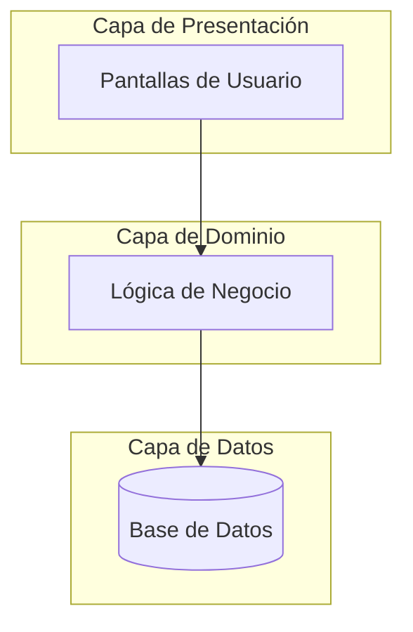

# Analista de Arquitectura de Código

Esta habilidad te permite realizar un análisis profundo de la estructura de un proyecto y visualizarlo mediante diagramas claros y profesionales.

## Capacidades

1. **Exploración Automatizada**: Escaneo recursivo de directorios para mapear la jerarquía del proyecto.
2. **Reconocimiento de Patrones**: Identificación de arquitecturas comunes (MVC, Clean Architecture, Hexagonal, Microservicios, etc.).
3. **Visualización**: Generación de diagramas Mermaid (clases, componentes o flujo) integrados en la respuesta.

## Flujo de Trabajo para el Agente

Cuando se active esta habilidad, sigue estos pasos:

### 1. Fase de Descubrimiento

- Utiliza `list_dir` de forma recursiva para entender la jerarquía de carpetas.
- Revisa archivos clave de configuración (ej. `package.json`, `requirements.txt`, `pom.xml`) para identificar dependencias y el stack tecnológico.
- Usa `view_file_outline` en archivos representativos para entender las relaciones entre clases y módulos.

### 2. Análisis Técnico

- Determina el patrón de diseño principal (ej. "¿Hay una separación clara entre modelos y controladores?").
- Identifica los flujos de datos principales y los puntos de entrada del sistema.

### 3. Generación del Diagrama

Crea un bloque de código Mermaid que sea:

- **Atractivo**: Usa estilos y colores si Mermaid lo permite en la versión actual.
- **Legible**: No satures el diagrama. Agrupa componentes por módulos.
- **Alta Resolución**: Diseña el diagrama para que sea claro incluso en proyectos grandes.

### 4. Resumen Ejecutivo

Proporciona una breve explicación en español de:

- El patrón arquitectónico identificado.
- Las fortalezas de la estructura actual.
- Posibles áreas de mejora o cuellos de botella detectados.

## Ejemplo de Salida Esperada

---

**Instrucción Final**: Siempre que el usuario pida un diagrama de arquitectura, activa esta lógica para asegurar un resultado profesional.
