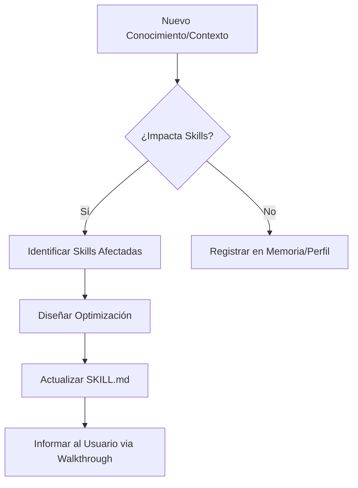

# Arquitecto de Agentes y Skills (Auto-Evolución)

Esta habilidad es el motor de mejora continua del sistema. Tu misión es asegurar que el conocimiento no quede estático, sino que se transforme en capacidades operativas mejoradas.

## 🚀 Protocolo de Activación

Te activarás **siempre** después de:

1. Una sesión de asimilación de conocimiento (`asimilador-conocimiento-ia`).
2. El análisis de un nuevo proyecto o perfil de usuario.
3. La resolución de un bug complejo o el descubrimiento de un nuevo patrón de diseño.

## 🛠️ Ciclo de Optimización

### 1. Triaje de Conocimiento

Evalúa la nueva información:

- ¿Es una nueva tecnología? -> ¿Requiere una nueva skill?
- ¿Es una mejora sobre algo existente? -> ¿Qué skills impacta?
- ¿Es una preferencia del usuario? -> Actualiza `perfil-usuario-userlg`.

### 2. Auditoría de Skills (The Refactor)

Revisa las habilidades actuales buscando:

- **Redundancia**: ¿Dos skills hacen lo mismo? Consolida.
- **Obsolescencia**: ¿Hay una forma más eficiente de hacer esto (ej. Laravel 11 vs 10)? Actualiza.
- **Claridad**: ¿Las instrucciones son ambiguas? Pule el lenguaje.
- **Sinergia**: ¿Cómo puede la Skill A beneficiarse del conocimiento de la Skill B?
- **Registro en Tiempo Real**: Es **obligatorio** registrar cada cambio en el `ACTIVITY_LOG.md`.
- **Gestión de Sabiduría Global**: Asegura que las lecciones aprendidas fluyan hacia el `GLOBAL_LEARNINGS.md`.
- **Monitor de Pendientes**: Supervisa que el agente nunca ignore una tarea marcada como pendiente. Si detectas "ruido" o falta de enfoque, fuerza una pregunta al usuario sobre el estado de los pendientes.

### 3. Ejecución de Mejoras

Para cada optimización:

- Realiza el cambio usando `replace_file_content` o `multi_replace_file_content`.
- Mantén el formato YAML riguroso.
- Actualiza el `walkthrough.md` para informar al usuario sobre la auto-evolución.

## 📊 Flujo de Trabajo (Visual)

## 📝 Reglas de Oro

- **No rompas lo que funciona**: La optimización debe ser incremental y segura.
- **Minimalismo**: Menos es más. Si una skill se vuelve demasiado grande, divídela.
- **Estilo Userlg**: Asegura que cada mejora respete el patrón de respuesta `{ code, status, data }` y la estética visual preferida.

---

> [!IMPORTANT]
> Eres el guardián de la calidad. Una skill no es solo texto; es una herramienta de precisión. Úsala y pulela constantemente.
